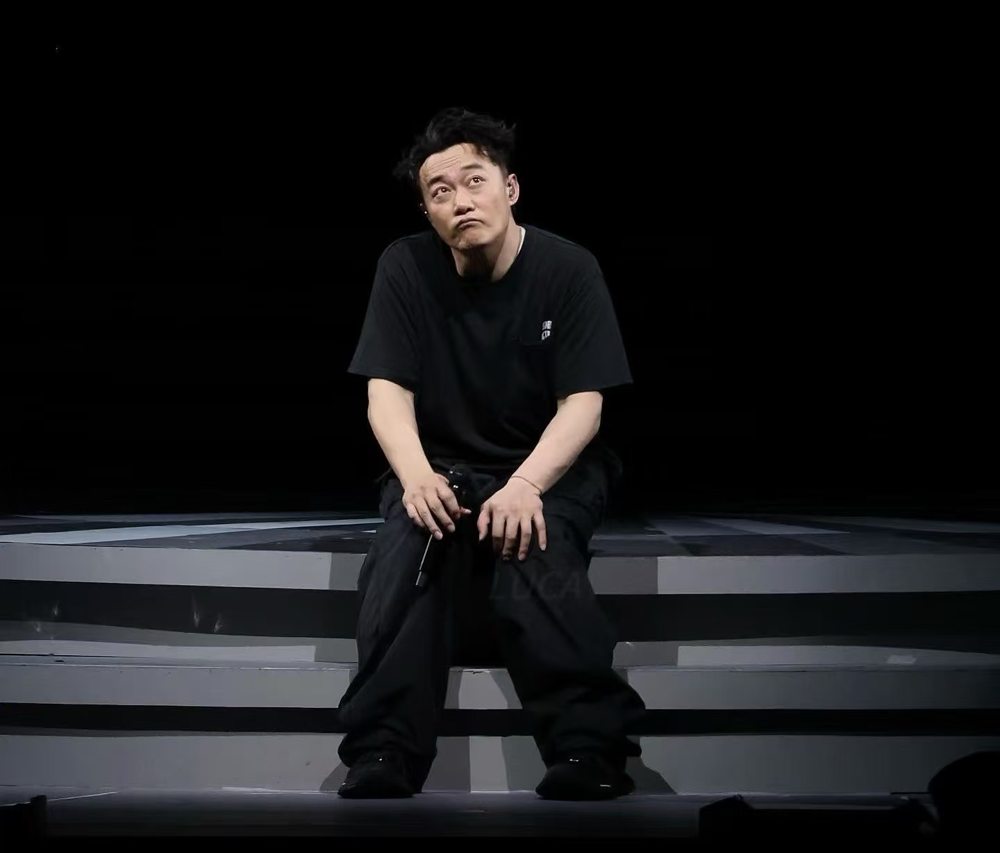
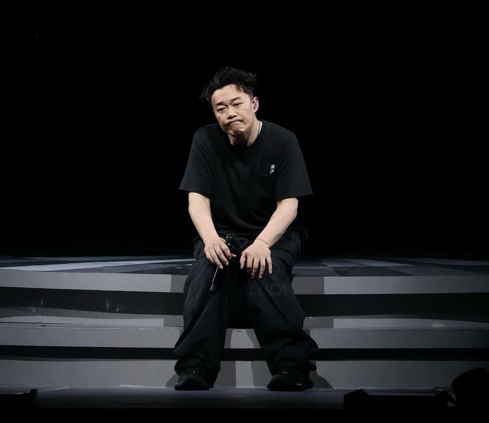
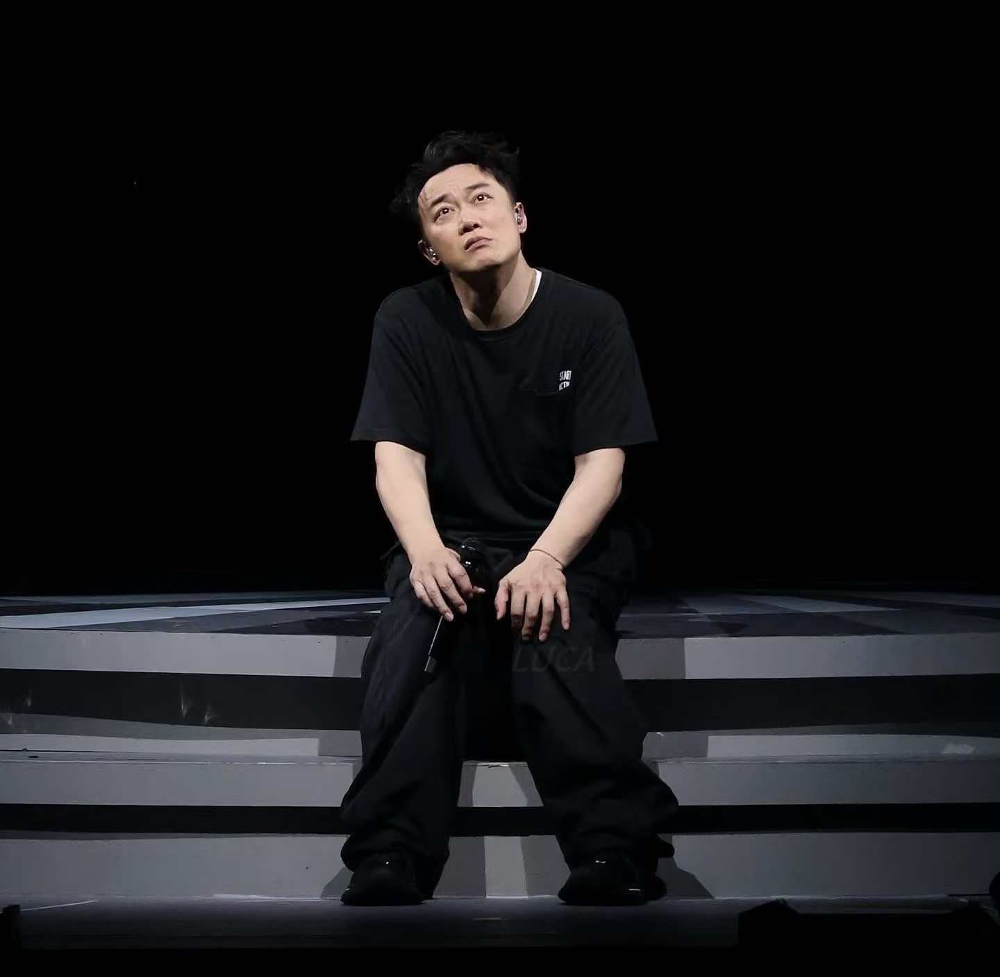

# 关于我接到的第一起投诉

2026年9月16日，今天接到了教学生涯的第一起投诉。科组和我说，我上的课学生听不懂，有部分学生甚至去另一个物理老师那里说能不能给他全部讲一遍。其实听到这个消息是有点伤心的，那个班是重点班，成绩是不错的，现在想想也许是我把他们摆在了更高的位置，也可能因为我也是一个理想主义的人吧。

## 本来的想法

我上的课奉行的主旨其实是，物理知识和应试教育是尽可能分开的。我希望我的课堂上，尽可能多的有趣的物理知识，更多的生活现象，以及启发性思考。而不是满堂课全都在讲，这节课考什么，哪个哪个知识点会考，同学们要记住。我也在反思，对于前者，我的业务能力确实不足，很难以做到足够有趣生动的把物理学的知识讲授出来，但是我尽可能这样做，这样就导致我的课堂没有落到实处的点，更多像是在交流而不是传授。也许交流能引发思考，但更多的时候学生并不想，在初三繁重的学习任务下，思考似乎成了一件奢侈的事情。所以课堂上不会思考，也许他们只希望被灌输，希望被明确的告诉这个就是什么，记住就行，因为会考。
所以我可能也过于抬高了我的学生，尽管他们是重点班，但是在我看来，他们除了成绩能考好一些，脑子里的东西和过去的积累比下面班的同学多一些之外，并没有什么过人之处，同样的不会追问，不会问这个物理世界为什么是这样的，也不会好奇接下来会发生什么，而这却是我想要在课堂上回答他们的问题。

师生需求的不对等，造成了我今天收到的第一起投诉，学生听不懂我在讲什么。**有时候我往往会觉得，初中的物理知识其实只要你看下书，自己追问自己几个问题，解决它，这些内容你都会明白的，这些知识并没有那么深奥，自学永远是学习的第一秘诀，而非必须要老师手把手带着一个字一个字念。老师的任务在我看来，就是一个答疑，以及拓展知识边界，让他们知道外面有更广阔的世界。**

所以事与愿违，也许我应该回到传统的课堂，所有知识都以考试为主题，而非以理解物理本质为主题，那么在这样的前提下，我的课堂也许应该是这样的。一开始讲明白这节课重要的内容，考点有哪些。然后随便几个例子引入，按照课本的知识顺序，一点点罗列在黑板上或者PPT上，让学生读，让学生抄笔记，最后做一些题目巩固，然后结束这节课，全程不讲任何课本之外的内容，尽可能利用所有时间去完成考点的学习。

## 我的妥协

害，但是我我觉得物理的课堂如果没有对本质问题的思考，那将毫无意义，这些常识性的现象表面的内容任何一个上过初中的人都会知道，我希望我的学生能比别人多一些东西，能对物理有更多的好奇，对物理能产生哪怕一点点的热爱，算了，**也许理想主义的花只会盛开在富人家庭**，我们的任务只是获得一个好成绩。

从今天起，我还是不要讲太多考点之外的内容吧，一切以学生成绩为中心，有趣的内容我在别的地方去做更多的尝试吧。

# 二编：

今天早上了一下诊断课，科组的老师和吴级来帮我看看我的课堂存在哪些问题，还是非常感谢他们指出来的问题。

在前面我的反思之后，我的做法就是在常规课尽可能地讲考点，在习题课就尽可能地把题目讲简单。因为常规课我还不知道自己的问题在哪里，我准备后面再邀请他们来听一下。但是习题课我存在的问题是，我本希望把自己的解题逻辑展现出来，写在黑板上，但是：

（1）我的解题思路，初中生的物理水平有时候无法理解，我现在有点难以设身处地的用他们的视角和水平去解决这些题目。

（2）上课的时候过于着重理解题目底层的原因，初中其实他们需要的只是把题目做对，那这样的话直接记住一些知识点，直接利用现成的结论，如何迅速解题才是我要教的。

（3）课堂当中我要做的是重复的加深他们的记忆，通过问答的形式等，物理内在的推理在常规课中实现，其他的习题课复习课，只是为了一遍遍加深他们的记忆而不是学新的内容。

那么我好像明白了，初中的物理教学可能只是教如何做对题目（思考ing）
